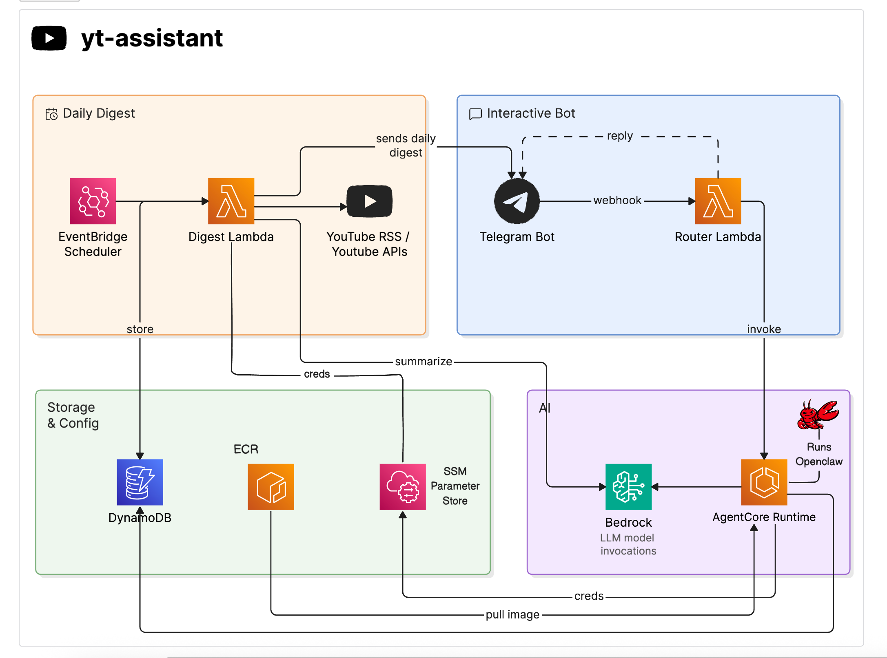

# yt-assistant

A personal YouTube assistant: daily subscriptions digest + interactive AI agent, powered by AWS Bedrock and Strands Agents on AgentCore.

## Features

1. **Daily Subscription Digest:** Fetches the last 24hrs YouTube subscription videos, summarizes them using AWS Bedrock, and sends a formatted daily digest to Telegram.
2. **Interactive Assistant:** Search across the video summaries by topic/channel name/date, save videos to playlists, all through natural conversation on the same Telegram bot.
3. **Cross-session Memory:** Conversations persist across container restarts via AgentCore Memory.

**Example queries:**
- What AI or cloud videos came out this week?
- Did any of my channels talk about serverless recently?
- Show me everything I missed about Kubernetes in the last 3 days
- Save 2nd, 5th, 7th video from the above list for later
- What did fireship post this week?
- Save all Anthropic release videos from today to a new playlist called AI releases

## Architecture




## Project Structure

```
├── cdk/
│   ├── app.py                  # CDK entry point
│   ├── stack.py                # All infrastructure (Lambda, EventBridge, DynamoDB, ECR, IAM)
│   ├── test_stack.py           # Infrastructure tests
│   └── requirements.txt
├── lambda/
│   ├── handler.py              # Digest Lambda orchestrator
│   ├── youtube.py              # RSS feeds + YouTube API fallback + transcripts
│   ├── summarizer.py           # Bedrock batched summarization
│   ├── telegram.py             # Telegram message delivery
│   └── requirements.txt
├── router/
│   ├── handler.py              # Router Lambda (Telegram webhook → AgentCore)
│   └── requirements.txt
├── strands/                    # Active — interactive agent (Strands SDK)
│   ├── agent.py                # Agent with tools + AgentCore Memory
│   ├── server.py               # HTTP server (BedrockAgentCoreApp, port 8080)
│   ├── Dockerfile              # ARM64 container for AgentCore Runtime
│   ├── requirements.txt
│   └── tests/
│       └── test_agent.py       # Unit tests
├── openclaw/                   # Inactive — previous agent implementation (kept for reference)
│   ├── Dockerfile
│   ├── agentcore-contract.js
│   ├── entrypoint.sh
│   ├── openclaw.json
│   ├── workspace/
│   └── skills/
└── docs/
    └── architecture.png
```

## Setup

### Prerequisites

- AWS account with Bedrock model access
- AWS CLI configured with a named profile
- Python 3.12+
- Node.js 18+ (for CDK)
- Docker Desktop (for Lambda bundling + OpenClaw container builds)
- Telegram bot
- Google Cloud project with YouTube Data API v3 enabled + OAuth credentials

### One-time Setup

1. **Google OAuth:** Create GCP project and get OAuth credentials
2. **Telegram Bot:** Create via @BotFather, get token and chat ID
